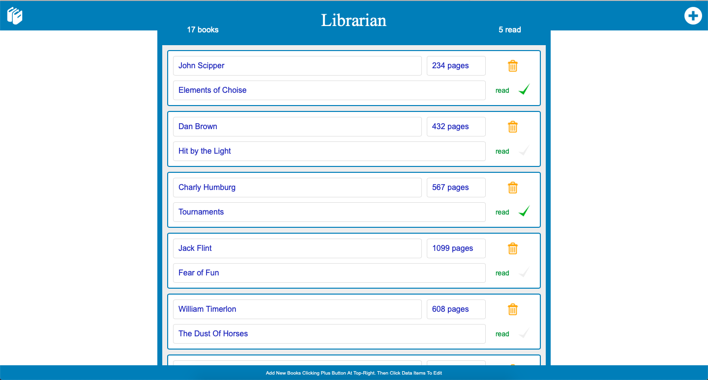

# Librarian

<!--
*** Thanks for checking out this README Template. If you have a suggestion that would
*** make this better, please fork the repo and create a pull request or simply open
*** an issue with the tag "enhancement".
*** Thanks again! Now go create something AMAZING! :D
-->

<!-- PROJECT SHIELDS -->
<!--
*** I'm using markdown "reference style" links for readability.
*** Reference links are enclosed in brackets [ ] instead of parentheses ( ).
*** See the bottom of this document for the declaration of the reference variables
*** for contributors-url, forks-url, etc. This is an optional, concise syntax you may use.
*** https://www.markdownguide.org/basic-syntax/#reference-style-links
-->

[![Contributors][contributors-shield]][contributors-url]
[![Forks][forks-shield]][forks-url]
[![Stargazers][stars-shield]][stars-url]
[![Issues][issues-shield]][issues-url]

<!-- PROJECT LOGO -->
<br />
<p align="center">
  <a href="https://github.com/ioanniskousis/Librarian">
    
  </a>
  
  <h3 align="center">The Librarian Application</h3>
  
  <p align="center">
    This project is part of the Microverse curriculum in JavaScript course!
    <br />
    <a href="https://github.com/ioanniskousis/Librarian"><strong>Explore the docs »</strong></a>
    <br />
    <br />
    <a href="https://github.com/ioanniskousis/Librarian/issues">Report Bug</a>
    <a href="https://github.com/ioanniskousis/Librarian/issues">Request Feature</a>
  </p>
</p>

This is a small Library application where the user can add or remove books, edit their author, title, number of pages and toggle a 'Have Read' switch  

<hr />

## Application Screen Shot  


<hr />

<!-- TABLE OF CONTENTS -->

## Table of Contents

- [About the Project](#about-the-project)
- [Application Instructions](#application-instructions)
- [System Requierments](#system-requierments)
- [Development](#development)
- [Built With](#built-with)
- [Contributors](#contributors)
- [Acknowledgements](#acknowledgements)

<!-- ABOUT THE PROJECT -->

## About The Project  

  The project uses two main classes, Library and Book.  
  The Library class holds an array of Books, manages the additions and deletions of Books, provides information about the total number of Books and the number of Books being read, supplies new IDs for new Books, and stores its data in localStorage.  
  The Book class holds information about a Book, which is the author, the title, the number of pages, and a status denoting if the book has been read.  
  The application's interface is a single view showing a scrolling table of all Books in the storage, a button at the top-right to add new books, a home button at the top-left (usefull when all books are deleted, to re-initialise the library) and an instruction note at the footer to inform the user how to add new Books.  
  Each Book entry in the table shows the Book's data and a trash button to delete the relevant book.  

  The main control of the application is performed in main.js file.  
  The Library and Book classes are implemented in library.js file.  
  The rendering of elements is supported by the bookPanelElements.js file.  
  Two shorthand commands for creating and accessing elements are used and are held in syntax.js file.  
  An initial population is performed when the Library is empty of Books by data held in seed.js.   


<hr/>

<!-- ABOUT THE PROJECT -->

## Application Instructions  

  - Initially, the Library is filled with some data held in the seed.js file  
  - The user can click the add button at the top-right and an entry of the new book is added at the bottom of the table prompting to enter its first field - the author's name     
  - Then, by clicking each of the rest of the fields can edit its title and number of pages and declare if the book has been read    
  - A trash button is available to remove each book after confirmation  

  - Since the persistence of data is achieved using the localStorage, all the data inserted or edited are available only on the computer and the particular browser which have been used.  

  - Text fields can not be left blank.  
  
<hr/>

## System Requierments
  - JavaScript Enabled

<hr/>

## Development
  * Clone the project
  ```
    https://github.com/ioanniskousis/Librarian.git
    
    Use VSCode and Live Server to show index.html
  ``` 
<hr/>

## Built With

This project was built using these technologies.

  - JavaScript (ES6)
  - HTML5
  - CSS3
  - Git - GitHub
  - ESLint
  - Stylelint
  - Stickler

<hr/>

<!-- CONTACT -->

## Contributors

:bust_in_silhouette:
​
## Ioannis Kousis

- Github: [@ioanniskousis](https://github.com/ioanniskousis)
- Twitter: [@ioanniskousis](https://twitter.com/ioanniskousis)
- Linkedin: [Ioannis Kousis](https://www.linkedin.com/in/jgkousis)
- E-mail: jgkousis@gmail.com
​
<hr/>
<!-- ACKNOWLEDGEMENTS -->

## Acknowledgements

  - [Microverse](https://www.microverse.org/)
  - [The Odin Project](https://www.theodinproject.com/)


<!-- MARKDOWN LINKS & IMAGES -->
<!-- https://www.markdownguide.org/basic-syntax/#reference-style-links -->

[contributors-shield]: https://img.shields.io/github/contributors/ioanniskousis/Librarian.svg?style=flat-square
[contributors-url]: https://github.com/ioanniskousis/Librarian/graphs/contributors
[forks-shield]: https://img.shields.io/github/forks/ioanniskousis/Librarian.svg?style=flat-square
[forks-url]: https://github.com/ioanniskousis/Librarian/network/members
[stars-shield]: https://img.shields.io/github/stars/ioanniskousis/Librarian.svg?style=flat-square
[stars-url]: https://github.com/ioanniskousis/Librarian/stargazers
[issues-shield]: https://img.shields.io/github/issues/ioanniskousis/Librarian.svg?style=flat-square
[issues-url]: https://github.com/ioanniskousis/Librarian/issues

